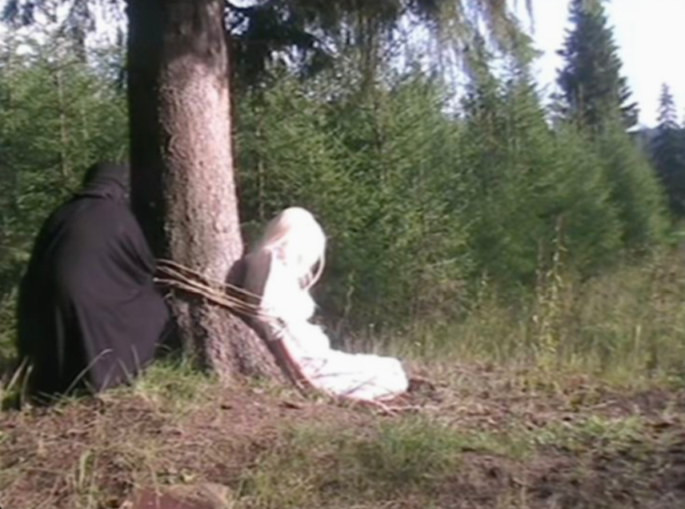
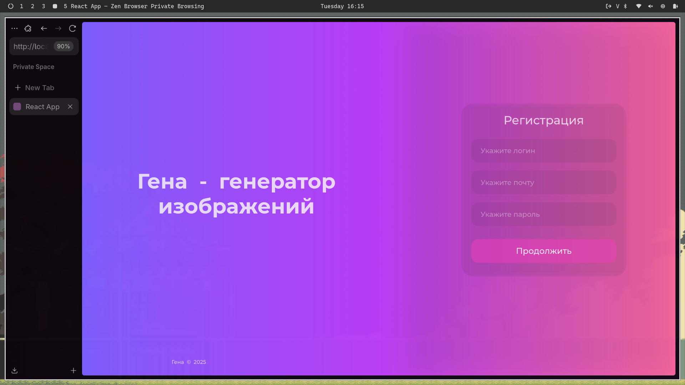
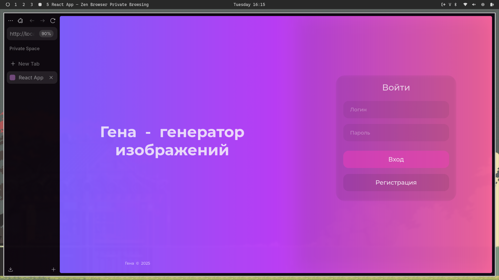
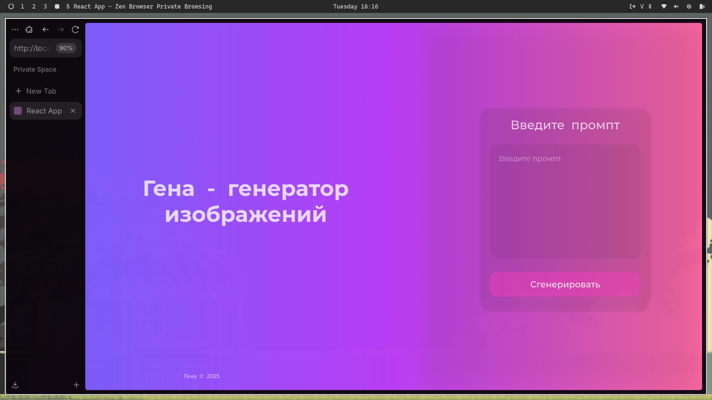
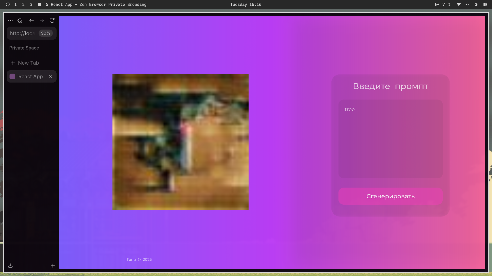

# Учебный проект по предмету "Технологии сетевого программирования"

**Тема проекта:** *Гена* - генератор изображений по текстовому описанию.

**Авторы проекта:** Иванова Дарья, Мещеряков Сергей

---
## **Screenshots**

### **Страница регистрации**

### **Страница логина**

### **Главная страница**

### **Главная страница с результатом генерации**

---

## **Распределение обязанностей:**

**Иванова Дарья:** api (methods), devops (docker compose), frontend

**Мещеряков Сергей:** backend, ml, mlops (a bit), frontend v2

## **Стек:**

1. RestAPI
2. FastAPI, Django, PyTorch
3. Docker
4. React

## **To DO:**

1. Clean code
2. ~~Update frontend to match figma~~
3. Better GAN model
